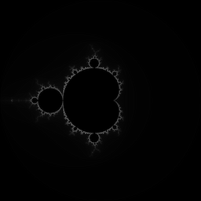
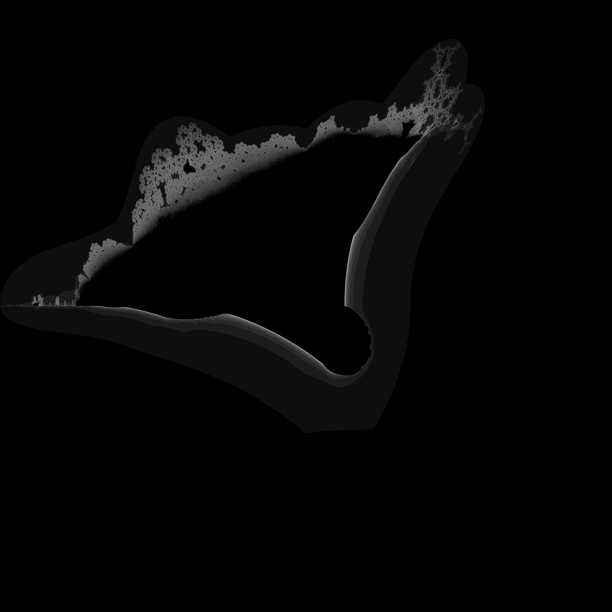

## **how do markdown?**

*rotating cube rendered from scratch in my terminal*

*Oct 28, [PureMath](https://github.com/nptnl/puremath)*

*simple mandelbrot render from scratch*

*Nov 01, [PureMath](https://github.com/nptnl/puremath)*

*sizeable render of the burning ship fractal from scratch*

*Nov 16, [Chromium](https://github.com/nptnl/chromium) (Rust)*

images displayed are low-resolution for faster profile loading. View the full renders [here](https://github.com/nptnl/nptnl)