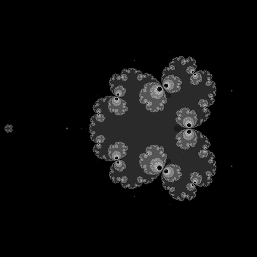

## **how do markdown?**

I'm a math major at Georgia Tech who codes math stuff for fun.

Most of my projects are created without using any libraries or dependencies; I enjoy it more when everything is from the ground up, especially with math stuff.

see some more very cool fractals and whatnot in [nptnl/nptnl](https://github.com/nptnl/nptnl)
(beware browser, large fractal images)
