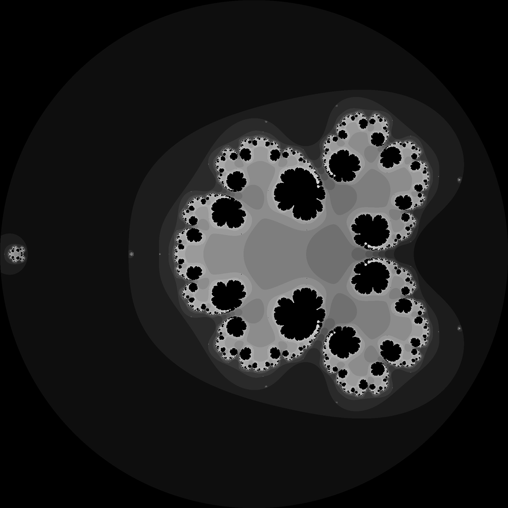

## **how do markdown?**

I'm a senior in high school interested in programming as applied to math and physics.

Most of my projects are created without using any libraries or dependencies; I just enjoy it more when everything is from the ground up, especially with math functions.

see some more very cool fractals and stuff in [nptnl/nptnl](https://github.com/nptnl/nptnl)
(beware browser, large fractal images)
